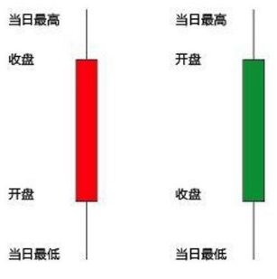
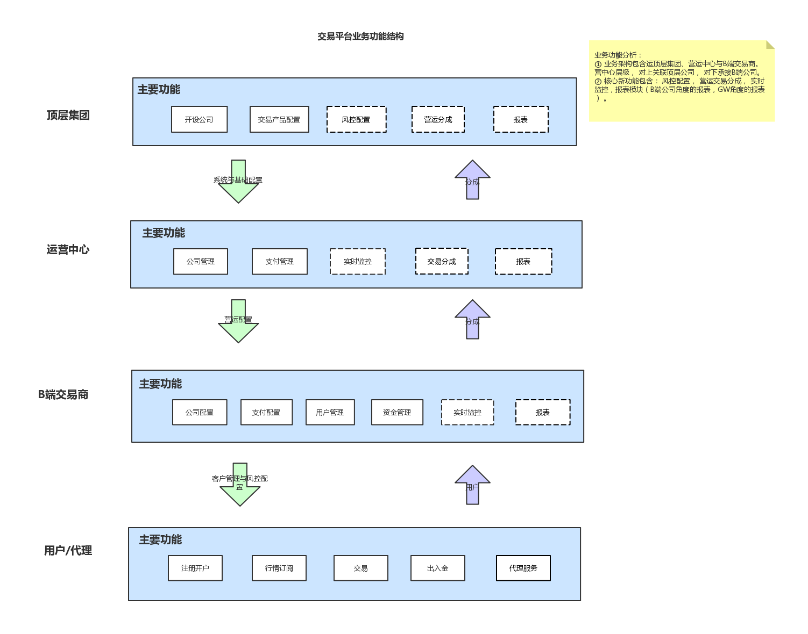
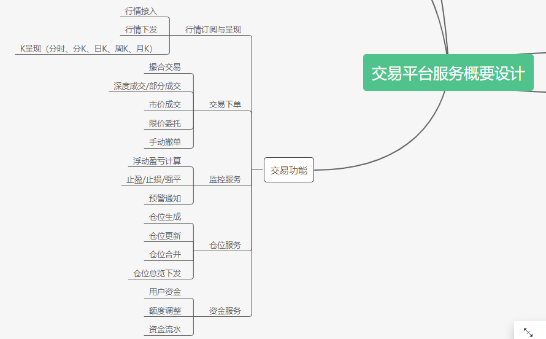
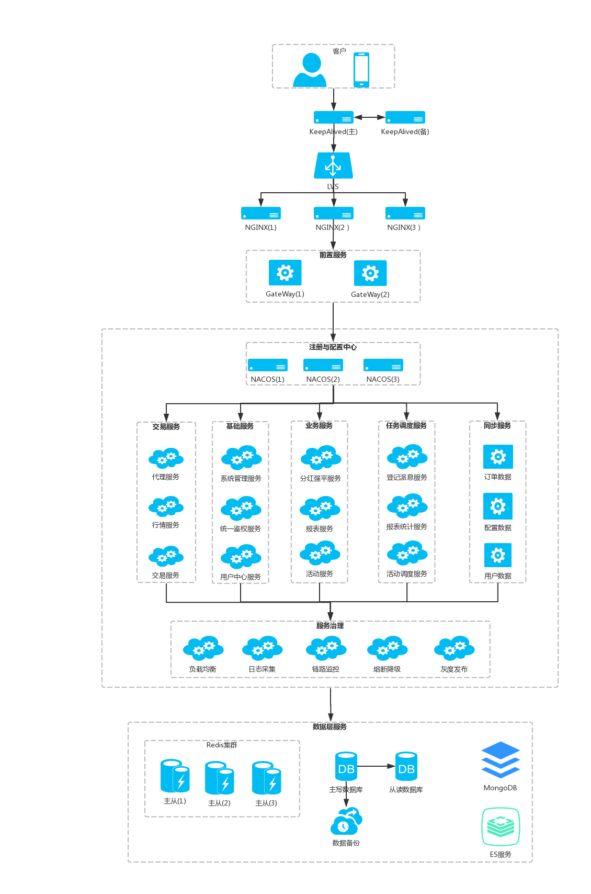
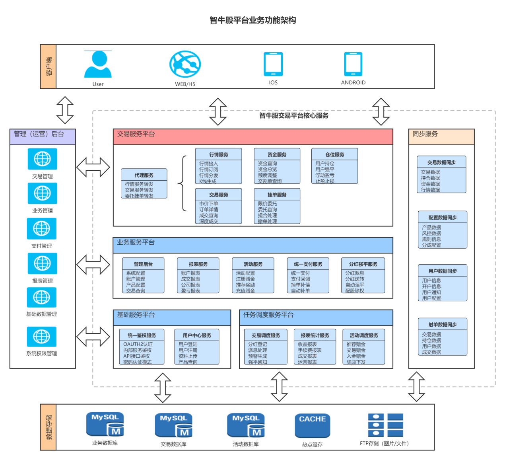
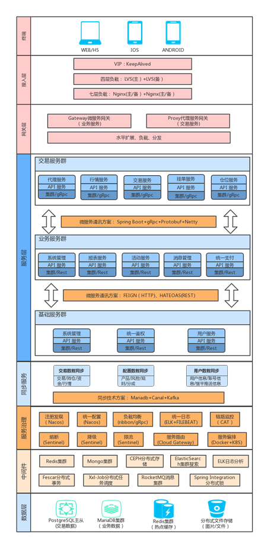

# 智牛股


### 第1章 项目介绍 

### 1. 目标

- 了解项目整体设计， 主要功能与所用到的技术栈
- 掌握金融背景基础知识，拓展理解相关业务知识
- 了解项目的技术特色与技术解决方案
- 掌握技术选型与分析

### 2. 路径

- 项目简介
- 服务架构图
- 金融背景知识
- 项目需求分析
- 项目架构设计
- 技术的比对分析案例

### 3. 讲解

#### 3.1 项目简要介绍

+ 金融交易平台是服务于金融衍生产品， 包含外汇、贵金属、期货、股票等。 各产品具有不同属性与交易规则， 本项目对标MT4/MT5等大型交易平台， 遵循FIX全球最广泛的金融市场通用协议。 包含证券用户注册、交易开户、行情订阅与呈现、 市价下单、委托挂单、撤单、 撮合交易等核心业务功能。项目特点： 专业化金融交易平台、高性能支撑海量交易数据、 完整的交易业务链， 实现竞价撮合机制， 具备广泛兼容性、高扩展性。

+ 项目采用前后分离、遵循Restful规范设计，微服务架构、领域驱动设计、 以Spring Cloud生态为核心、采用众多主流组件实现。遵循OAUTH2授权标准， 统一认证鉴权。

+ 服务无状态化设计、支持采用集群模式部署、无缝水平扩展、全链路式监控、统一日志管理， 完善的微服务治理体系。

+ 技术栈： 项目设计充分考虑性能， 稳定性， 扩展性与可维护性，技术选型上横向与纵向详细对比，选取最新且主流的技术方案， 技术运用上，全面考虑， 高效结合， 充分发挥性能。 业务实现上， 针对不同业务场景选取最优技术方案， 不墨守成规，保障业务稳定性的同时， 提升业务处理性能， 发挥系统整体优势。主要技术栈包含Spring Boot、Spring Cloud Alibaba、CAT全链路监控、Sentinel熔断限流、RocketMQ订阅分发、Seata Server分布式事务、Spring Security OAuth2 统一鉴权、Ceph分布式文件系统操作、XXL-JOB分布式任务调度平台，持续集成（Jenkins+Git+Maven+Docker）、 微服务高效通讯方案（SpringBoot2.X+ Netty+Protobuf+gRpc集成运用）等等。


#### 3.2 股票基础知识介绍
+ 什么是股票
股票是一种由股份制有限公司签发的用以证明股东所持股份的凭证，它表明股票的持有者对股份公司的部分资本拥有所有权。由于股票包含有经济利益，且可以上市流通转让，股票也是一种有价证券。我国上市公司的股票是在上海证券交易所和深圳证券交易所发行，投资者一般在证券经纪公司开户交易。
+ 什么是K线
股市及期货市场中的K线图的画法包含四个数据，即开盘价、最高价、最低价、收盘价，所有的k线都是围绕这四个数据展开，反映大势的状况和价格信息。如果把每日的K线图放在一张纸上，就能得到日K线图，同样也可画出周K线图、月K线图。

+ 基本规则
   + 交易时间
   上午9：30 --11：30 
   下午13：00 -- 15：00
   
   + 涨跌幅限制
   每只证券的交易价格相对上一个交易日收市价的涨跌幅度不得超过10% 。
   
   + 交易单位
   股票的交易单位为“股”，100股=1手， 委托买入数量必须为100股或其整数倍；
   
   + 价格优先
   
      较高价格买进申报优先于较低价格买进申报， 较低价格卖出申报优先于较高价格卖出申报；
   
   + 时间优先
   
       买卖方向、价格相同的， 先申报者优先于后申报者
+ 如何交易
   + 开设账户
     通过证券公司注册开设账户
   
   + 传递买卖指令
     一般通过交易软件， 下达买卖指令， 由券商传递给交易所。
   
   + 成交过程
     交易所接收到交易指令， 按撮合方式进行交易。
   
   + 撮合处理
   
     所有的买委托按照委托限价由高到低的顺序排列，限价相同者按照进入系统的时间先后排列；所有卖委托按委托限价由低到高的顺序排列，限价相同者按照进入系统的时间先后排列。
   
     依序逐笔将排在前面的买委托与卖委托配对成交，即按照“价格优先，同等价格下时间优先”的成交顺序依次成交，直至成交条件不满足为止，即不存在限价高于等于成交价的叫买委托、或不存在限价低于等于成交价的叫卖委托。所有成交都以同一成交价成交。  
   
   + 交割
     买卖股票成交后，买主付出现金取得股票，卖主交出股票取得现金。
   
   + 过户
   	交割完毕后，新股东应到他持有股票的发行公司办理过户手续，即在该公司股东名册上登记他     自己的名字及持有股份数等。完成这个步骤，股票交易即算最终完成。过户是会收取一定手续费。


#### 3.3 需求介绍

整个平台支持三个层级运作， 包含 B 端交易商、 营运中心与顶层集团。
本项目侧重 B2C 的业务， 可以忽略营 运中心层级， 重点关注 B 端交易商与C 端用户的功能实现。


核心功能包含行情订阅、K线呈现、撮合交易、深度成交、市价成交、限价委托、手动撤单、仓位总览、资金总览等等。实现整个完整服务流程。



#### 3.4 架构设计介绍

+ 服务架构设计


+ 功能架构设计




+ 技术架构设计：
  
   


+ 服务架构设计说明
  
   + 接入层与前置服务
     在实际生产环境部署中， 采用Nginx主备模式接入，通过Spring Cloud Gateway调用业务集群， 根据请求路径，映射调用不同的微服务。     
   
   + 交易服务群
     代理服务负责交易与行情的处理， 采用Netty对接， 内部交易与行情微服务群采用SpringBoot2.X+Protobuf+gRpc连接调用， 交易是整个项目的核心， 主要分为代理服务， 负责客户端接入与数据的分发；行情服务，负责第三方行情源接入， 客户端的订阅与下发处理；交易服务， 处理核心交易逻辑， 包含撮合、深度、委托挂单、撤单等功能。还有仓位服务、资金服务、监控服务等，支撑完善交易服务功能。
   
   + 基础服务群
     将系统底层基础模块抽离封装，划分为系统管理服务、用户中心服务、统一鉴权服务等。 这些基础模块职能单一， 划分清晰， 不能存在过度耦合与复杂逻辑， 便于扩展与其他业务服务的接入。
   
   + 业务服务群
     包含派息分红、拆股强平服务、支付出金服务、报表服务， 活动服务等等。业务服务的拆分，需要认清业务的核心环节， 把控服务粒度， 微观解耦， 宏观统一， 整体有序。在服务治理， 部署， 规划上， 加强核心业务的管控与稳定性。
   
   + 任务调度服务群
     整个交易平台存在异步计算、监听、返写、预警触发、通知记录以及业务数据处理等各种调度任务；解耦核心业务处理， 保障稳定性； 采用专业ElasticJob分布式任务调度与治理框架， 提升系统吞吐能力与稳定性。
   
   + 同步服务群
   
     交易数据与业务数据分离设计， 保障核心交易数据的稳定性， 同时提升业务数据处理的灵活性与扩展性， 需要实现交易与业务数据的同步， 主要分为用户信息与资金数据、产品配置与管理数据、订单交易与流水数据。 金融场景对数据存在较高的敏感， 同时又要求较高的实时性， 需要充分考虑数据的安全， 性能与稳定。
     
   + 服务治理
     
     微服务架构设计有众多优点， 但过多的服务也会带来一系列的治理问题， Spring Cloud 整个生态拥有丰富的开源服务治理组件， 具备完整服务治理能力。 包含负载均衡、动态路由、日志采集、全链路监控、熔断降级等。相比Istio服务网格治理理念，它是把微服务框架与服务治理进行拆分，适合更大规模的微服务群，  而数十个规模的微服务， 采用Spring Cloud 足够驾驭且便于研发人员设计与管控。
     
   + 数据层服务
   
     数据库采用PostgreSQL主从模式存储交易数据； MariaDB集群模式存储业务数据。从规划上做好读写分离， 保障主库数据处理的稳定性， 集群模式提升数据库的可扩展性及高可用， 支撑海量数据高效运行。


#### 3.5 整体技术说明
整体服务层划分为前端交互、接入层、 接口层、服务中间件、数据层服务组件、服务管理组件。

支持Jenkins持续集成， Docker虚拟化与DevOps管理， 采用主流数据库技术， MariaDB集群作为业务数据库， PostgreSQL主从作为交易数据库， 多种技术结合， 发挥最佳性能， 支持大型数据项目应用。

+ 接入层技术 
  
  接入服务， 采用LVS+NGINX+KEEPALIVED， 实现了整体服务的负载均衡与高可用。
  
  业务服务， 集成Spring Cloud Gateway， 能够支持自定义路由转发， 支持OATUH2鉴权。
  
  交易服务， 采用高效Netty NIO接入， 内部采用高性能的gRPC+ PB方式通讯。
  
+ 服务注册与统一配置
  采用Nacos集群， 以MariaDB作为数据源， Nginx作负载。 支持所有微服务的注册发现与统一配置管理， 能够按不同环境管理不同的配置信息， 同实支持配置信息的动态更新。

+ 应用层与通信技术

   分为内部服务与外部服务， 业务服务通过Gateway与外部对接， 交易与行情服务通过代理服务与外部对接。代理服务根据头部信息做路由转发处理。内部通信采用异步架构设计，结合RocketMQ集群， 提升吞吐量与处理效率。

   + 采用Spring Boot Starter gRPC + ProtoBuf实现，gRpc通讯性能要高于基于http方式的feign，PB数据效率要高于Json， 优点便捷、高效、广泛兼容性，主要用来实现用户交易数据的处理。
   + 采用Netty作为长连接的NIO框架， 处理交易数据与行情数据， 因为交易数据存在异步处理特征，以及行情数据的高频度特征， 使用高效的NIO框架加上长连接的方式更为合适。
   + 业务数据对外HTTP接口，遵循RestFul规范， 前后分离方式， 实现管理后台以及配置数据的处理。

+ 中间件
   + REDIS集群： 三主三从集群部署模式， 支撑更多数据量及灵活扩展， 同实保障高可用。 主要处理用户数据、产品数据等热点信息。
   + Mongo集群： 对于高频次存取， 同实要保障数据的持久化， MongoDB相比传统DB更为合适。 主要负责支付信息数据以及二次加工数据的处理。
   + Ceph分布式文件存储： 强一致性， 保障数据的可靠，基于此特征， 适合金融交易平台， 主要处理一些小文件， 比如用户证明文件， 图像，验证码等信息。
   + ElasticSearch集群：在搜索方面目前有最为广泛的应用及优越的性能表现， 主要处理用户埋点信息， 登陆操作日志行为等搜索功能。
   + XXL-JOB分布式任务调度框架：  XXL-JOB是一个轻量级分布式任务调度平台，其核心设计目标是开发迅速、学习简单、轻量级、易扩展。现已开放源代码并接入多家公司线上产品线，开箱即用。  目前已有多家公司接入xxl-job，包括比较知名的大众点评，京东，优信二手车，北京尚德，360金融 (360)，联想集团 (联想)，易信 (网易)等等 。 在分布式任务的管理与调度实现上有着非常优越的表现。 适合处理异步任务， 回调任务， 返写任务， 统计报表等。
   +  Seata Server（Fescar）分布式事务框架： 阿里开源组件，  用于微服务架构的分布式事务解决,  特点是高性能且易于使用， 代码侵入性低，底层采用Netty实现， 有较好的性能表现。 负责处理交易服务与业务服务模块之间的事务处理。

#### 3.6 项目技术特色
+ 前后分离架构设计， 职责单一， 功能明确， 便于服务的扩展与维护。
+ 交易服务采用基于NIO非阻塞式Netty框架， 内部采用gRPC+Protobuf通讯， 保障交易服务的稳定可靠， 又能具有较好的性能。
+ 业务服务采用Spring Cloud GateWay作统一网关接入， 相比ZUUL其他网关有2-3倍性能提升； 前置采用Nginx作反向代理， Nginx是采用广泛且是高性能的反向WEB代理服务。 支持RestFul（短连接）与Netty（长连接）方式接入。
+ 主流成熟且先进的技术， 采用Nacos作服务注册发现与统一配置管理， 在这方面， 相比Eureka与Spring Cloud Config在性能与稳定性方面， 也是有非常明显的改进；采用Sentinel作为熔断限流组件， 相比Hystrix性能更优， 功能丰富； 采用主流的RocketMQ，适合互联网海量数据的同步处理；
采用ElasticSearch，在搜索方面目前有最为广泛的应用及优越的性能表现。 
+ 采用Spring Cloud最新版本及核心生态组件，集成Nacos作统一配置化管理， Sentinel作熔断降级控制， ELK作统一日志管理， 以及CAT组件完善的链路监控功能， 完善的服务治理功能， 便于线上维护。
+ 数据层服务采用Redis集群作热点缓存， Ceph作分布式文件存储， MongoDB作NoSQL缓存， 支撑海量交易服务。
+ Seata(fescar) Server 优秀的分布式事务TCC框架， 快速、高效、侵入性低。
+ Spring Boot 2.X + Gateway + Spring Security OAuth2 统一认证鉴权与Token增强技术运用。
+ 采用Jenkins+Git+Maven+Docker+Registry  持续集成技术、便于服务的管理与发布。  
+ 采用众多集群技术： MariaDB集群、Redis集群、RocketMQ集群、XXL-JOB集群、ES集群等， 生产级实践验证，支撑海量数据与高并发场景。

#### 3.7 技术解决方案

如上所述， 本项目包含以下技术解决方案：

1.	服务高可用解决方案（KeepAlived+Lvs+Nginx）
2.	微服务网关解决方案（Spring Cloud Gateway）
3.	微服务高效通讯解决方案（SpringBoot2.X+gRpc+Protobuf+Netty）
4.	微服务注册发现与配置管理解决方案。（Nacos集群+Mariadb+Nginx）
5.	微服务熔断降级限流解决方案（Sentinel + dashboard）
6.	微服务分布式事务解决方案（Seata Server）
7.	微服务异步消息架构解决方案（RocketMQ集群）
8.	微服务链路监控解决方案（Cat集群）
9.	微服务统一鉴权解决方案（OAuth2+Redis+TokenEhancer）
10.	微服务统一日志解决方案（ElasticSearch+Logstash+Kibana）
11.	 热点缓存解决方案（Redis集群）
12.	分布式锁解决方案（Spring Integration Redis）
13.	前后分离与文档管理解决方案（Swagger2聚合文档）
14.	多数据源解决方案（Spring Boot + Durid + JPA/MyBatis）
15.	 分布式文件存储解决方案（Ceph集群）
16.	 分布式搜索解决方案（ElasticSearch集群）
17.	 分布式任务调度解决方案（XXL-JOB集群）
18.	可持续集成自动发布解决方案（Jenkins+Git+Maven+Docker+Registry）

#### 3.8 如何技术选型

**技术是为业务服务，脱离业务的技术是空中楼阁。**

技术价值来源于用户与业务的需要， 如果没有业务支撑， 再好的技术也无从发挥。每个公司有自己的业务背景， 比如淘宝从早期的单一架构到分布式架构， 从单机部署到机房部署再到容器化及云平台， 技术不是一步到位，而是不断演进提升，跟随业务不断去改进，   不是越高大上的技术就越好， 找到适合的技术才是最好的。

技术选型对初创公司尤为重要， 合适的选型能少走很多弯路， 让产品更快推向市场， 更快赢得客户， 才能拓展更广阔的市场， 这样的公司在市场中才具备更强的竞争力。

要搭建一个新的技术平台， 先必须先了解其业务特性， 核心的业务场景， 交互的复杂度、 用户规模、 峰值请求量、推广营运计划等等， 做出版本规划， 迭代计划， 对于互联网产品， 版本计划周期不能太长， 一般两周左右一个版本， 这个时候你要做出合理的系统架构设计以及技术发展规划。 互联网发展， 日新月异， 需求千变万化， 没有人能够一开始就把所有设计做好。 从本源做起， 业务形态各式各样， 但不变的是底层，比如用户管理、系统管理、权限管理， 这些在大部份项目中基本上都脱离不了， 那么这块我们就可以充分考虑， 花时间去考究， 把这些功能统一设计， 统一管理、统一鉴权， 提供单点登陆功能，做成系统底层平台， 支持公司其他项目的接入， 不必再重复设计实现， 虽然只是一个功能模块， 但我们却可以做成一个平台服务， 用户规模增长越快， 其价值体现也就越大， 如果后面再去重构， 可能就要花费数倍代价，而且容易产生风险。

对于复杂多变的业务， 比如活动推广， 今天想做一个充一百送二十的活动， 运作半个月，发现效果不理想， 业务方把它拿掉， 又做一个用户推荐送赠金活动，发现还是没用户进来， 又做一个抽奖活动，  不断在市场中试验各种业务模式，对于这些业务， 我们就没必要把一个功能当作一个平台去充分考虑设计， 以实现功能为主， 快速推出， 在市场中看反映结果如何， 如果有一定效应， 那么再做第二版的时候， 我们再去改进底层， 再充分考虑其性能， 稳定性与扩展性，这样在激烈的竞争市场中我们能强得先机， 同时再加大投入也不会带来较多成本的开销，这些是需要我们站在更高的角度去规划与把控。

#### 3.9 技术选型案例
互联网的不断发展， 沉淀了很多优秀的开源技术， 对于众多的同类技术， 我们如何去选型， 怎么去分析做最终的决策， 前面说过， 合适的技术才是最好的， 下面我们拿MQ来做比对选型。
MQ技术众多， 包含RocketMQ、KAFKA、RabbitMQ、ActiveMQ、ZeroMQ等。技术比对要有横纵深度： 

对比点|ActiveMQ | RabbitMQ | RocketMQ|ZeroMQ|Kafka
- | -|- |-|-|-
成熟度|成熟|成熟|比较成熟|不成熟|成熟
社区活跃度|高| 高| 中|低| 高
文档| 多| 多| 中|中|多
优点|功能齐全， 大量开源项目使用| Erlang 语言开发， 并发能力，性能很好 | 支持上万个队列；多种消费模式；可靠性好| 低延时，低开销，高性能 |  多文件并发写入，高吞吐量
授权方式|开源|开源|开源|开源|开源
协议|OpenWire、STOMP、REST、XMPP、AMQP | AMQP |自定义协议| TCP、UDP| 仿AMQP
持久化|内存、文件、数据库|内存、文件| 磁盘文件|在消息发送端保存|磁盘文件
事 务|支持|不支持|支持|不支持|支持
集群|支持|支持|支持|不支持|支持
负载均衡|支持|支持|支持|不支持
管理界面|一般|好|可视化管理|无|一般
顺序|不严格|不严格|保证严格顺序|无法保障|不严格
单机性能|万级|万级|10万级|10万级|10万级

以上表格， 我们可以对比看出各消息队列的的优缺陷， 那么结合实际业务， 该如何选择？

我们做的是金融交易平台， 要求较高的性能与数据的一致性。

ActiveMQ和RabbitMQ虽然成熟度较高， 但是并非针对高吞吐量设计， 不适合互联网大数据量应用；

ZeroMQ有较好的吞吐性能， 但是其成熟度不高， 事务、集群与接入都不完善；

那么剩下RocketMQ和Kafka， 这两种队列都是针对大数据设计， 高吞吐性能，特征都比较相似；但是Kafka吞吐性能单机可以达到百万级， 而RocketMQ在十万级 ， 是不是就可以采用Kafka？ 性能问题解决了， 但是数据的一致性呢？ Kafka正因为其高性能，每个Partition一个物理文件， 带来的弊端是不能严格保证顺序， 这样就会导致数据出现错乱， 而金融场景对这点是非常严格苛刻， RocketMQ正是借鉴Kafka架构重新设计， 可以支持上千个Topic而不衰减。


RocketMQ消息投递保证了严苛的顺序， 虽然单机吞吐量不及Kafka， 但是可以通过集群方式弥补， 没有完美的技术， 基于这些特征， RocketMQ更适合金融场景的运用， 也是经过阿里支付场景海量数据的验证。


再来分析下， 熔断组件如何选型： 

我们熟知的熔断器组件有hystrix， 但其已停止开发， 官方推荐采用Resilience4j替代。阿里也开源了一个流量控制组件Sentinel, 其覆盖了阿里的所有核心场景， 积累了大量的流量归整场景及生产实践。

结合Hystrix、Resilience4j和Sentinel作个对比：
对比点 | Sentinel | Hystrix  |  Resilience4j
-|-|-|-
隔离策略|信号量隔离（并发线程数限流）|线程池隔离/信号量隔离|信号量隔离
动态规则配置|支持多种数据源|支持多种数据源|有限支持
扩展性|多个扩展点|插件的形式|接口的形式
限流|基于 QPS，支持基于调用关系的限流|有限的支持|Rate Limiter
系统自适应保护|支持|不支持|不支持
控制台|提供开箱即用的控制台，可配置规则、查看秒级监控、机器发现等|简单的监控查看|不提供控制台，可对接其它监控系统

再来分析Sentinel与Resilience4j的设计：

Hystrix采用的是执行模型， 基于RxJava实现， 通过线程池执行； Sentinel采用的是资源模型，资源定义与配置耦合度更低。

Hystrix提供两种隔离策略： 线程池隔离与信号量隔离， 线程池方式隔离度高， 但是代价是上下文切换的资源开销过高，对要求低延迟的调用有较大影响; Sentinel 可以通过并发线程数模式的流量控制来提供隔离功能， 并且结合基于响应时间的熔断降级模式， 可以在不稳定资源的平均响应时间比较高的时候自动降级，防止过多的慢调用占满并发数，影响整个系统。

Sentinel还支持基于平均响应时间的熔断降级， 可以防止调用非常慢造成的级联阻塞情况。 

综合比较， Sentinel 在流量控制，系统保护和实时监控方面有更多的支持， 设计考虑更为完善， 是一款轻量、高性能的流量管控组件， 适合金融交易场景的性能要求及各种复杂业务要求。


### 4. 小结

+ 了解项目的业务， 整体设计与所用的技术栈。
+ 了解金融背景基础知识，拓展交易业务知识面，  使用模拟交易软件， 提升对交易的认知与理解。

+ 项目需求， 三个层级： B 端交易商、 营运中心与顶层集团。

  + 平台设计结构支持多种模式运作， 自身作为顶层集团，给其他交易商提供服务， 支持SAAS化运作；整套平台也可以由一个独立交易商运作， 直接面向C端用户提供服务。

  + 了解平台核心业务功能： 行情、交易、资金、仓位等。

+ 了解整体服务架构设计，内部通讯方式， 服务部署架构， 核心业务所用的技术点。 

+ 技术选型： 

  掌握业务背景， 抓住业务核心， 业务与技术有效结合， 不能脱离实际， 空中楼阁。

+ 技术比对：  

  做技术选型一定要做技术比对， 不能自我局限， 固步自封， 作为一名资深技术人员， 与时俱进， 掌握主流技术， 知道何时何地用何种技术。


### 第2章 工程规范与环境搭建

### 1. 目标

- 掌握工程代码编写规范
- 掌握工程环境搭建

### 2. 步骤

- 工程结构规范
- 环境搭建配置

### 3. 实现

#### 3.1 工程结构规范

+ 应用分层：
<table width="500">
<tr>
    <td >终端显示层</td>
    <td>开放接口</td>
</tr>
<tr>
   <td  colspan="2"> ↑↑请求处理层（web层）↓↓</td>
</tr>
<tr>
<td  colspan="2"> 业务逻辑层（Service层）</td>
</tr>
<tr>
<td  colspan="2">↑↑数据持久层(dao层)↓↓</td>
</tr>
<tr>
    <td >数据源</td>
    <td>外部接口或第三方平台</td>
</tr>
</table>

+ 分层领域模型规范约束：
DO（Data Object） ：此对象与数据库表结构一一对应，通过 DAO 层向上传输数据源对象。
DTO（Data Transfer Object） ：数据传输对象， Service 或 Manager 向外传输的对象。
BO（Business Object） ：业务对象，由 Service 层输出的封装业务逻辑的对象。
AO（Application Object） ：应用对象，在 Web 层与 Service 层之间抽象的复用对 象模型，极为贴近展示层，复用度不高。
VO（View Object） ：显示层对象，通常是 Web 向模板渲染引擎层传输的对象。
Query ：数据查询对象，各层接收上层的查询请求。注意超过 2 个参数的查询封装，禁止使用 Map 类来传输。
POJO(Plain Ordinary Java Object)： 普通JAVA对象，只有属性及其set/get方法。
DTO(Data Transfer Object)： 数据传输对象，用在需要跨进程或远程传输时，它不应该包含业务逻辑。


+ 版本规范：
GroupID 格式： com.{公司/BU}.业务线[.子业务线]，最多4级。
ArtifactID 格式：产品线名-模块名， 例：dubbo-client, spring-boot, spring-mvc
Version 版本号： 主版本号代表产品方向改变，新功能， 新需求或较大技术重构调整；次版本为影响范围极小的功能或技术调整； 修订号主要为修复BUG, 优化等细节调整。注意起始版本号必须为： 1.0.0而不是0.0.1

+ 编写规范
类名与方法编写采用驼峰命名法， 接口以I开头， 实现类以Impl结尾。 例：用户接口为IUserService, 用户实现类为IUserServiceImpl。 其他详细规范请参考[《阿里巴巴Java开发手册》](https://www.jianshu.com/p/0d296596a74c)。

#### 3.2 环境搭建

1. 准备
   [Idea](https://www.jetbrains.com/idea/)
   [JDK1.8+](https://www.oracle.com/technetwork/java/javase/downloads/jdk8-downloads-2133151.html) 
   [MAVEN3.5+](https://maven.apache.org/download.cgi)
   [NACOS1.0.1](https://github.com/alibaba/nacos/releases)
   安装两个idea插件， 在idea的maketplace里搜索maven helper和lombok进行安装。

2. 启动Nacos
    修改Nacos配置文件application.properties，采用无密码登陆方式， 开启以下配置:
    
    ```properties
    spring.security.enabled=false
    management.security=false
    security.basic.enabled=false
    nacos.security.ignore.urls=/**
    ```
    执行bin目录下的startup.cmd启动， 访问http://127.0.0.1:8848/nacos 正常开到管理后台界面。
    

3. 工程搭建
   引入目前最新版本的[Spring Cloud Alibaba](https://github.com/alibaba/spring-cloud-alibaba)， 基于Spring Cloud Finchley版本封装。
+ 创建父级工程
  创建bulls-stock父级MAVEN工程。POM依赖：
  
  ```xml
    <!-- 自定义属性， 统一管理版本 -->
    <properties>
        <spring.cloud.alibaba.version>2.1.1.RELEASE</spring.cloud.alibaba.version>
        <spring-cloud-gateway.version>2.1.2.RELEASE</spring-cloud-gateway.version>
        <spring-boot.version>2.1.6.RELEASE</spring-boot.version>
        <maven.compiler.source>1.8</maven.compiler.source>
        <maven.compiler.target>1.8</maven.compiler.target>
        <maven-compiler-plugin.version>3.8.0</maven-compiler-plugin.version>
        <maven-jar-plugin.version>3.1.0</maven-jar-plugin.version>
  </properties>
  
    <dependencies>
        <!-- lombok 插件， 简化开发代码 -->
        <dependency>
            <groupId>org.projectlombok</groupId>
            <artifactId>lombok</artifactId>
            <optional>true</optional>
        </dependency>
  </dependencies>
  
    <dependencyManagement>
        <dependencies>
            <!-- Spring Cloud Alibaba 依赖组件 -->
            <dependency>
                <groupId>com.alibaba.cloud</groupId>
                <artifactId>spring-cloud-alibaba-dependencies</artifactId>
                <version>${spring.cloud.alibaba.version}</version>
                <type>pom</type>
                <scope>import</scope>
            </dependency>
            <!-- Spring Cloud 普通依赖组件 -->
            <dependency>
                <groupId>org.springframework.cloud</groupId>
                <artifactId>spring-cloud-commons-dependencies</artifactId>
                <version>${spring.cloud.alibaba.version}</version>
                <type>pom</type>
                <scope>import</scope>
          </dependency>
  
            <!-- Gateway组件 -->
            <dependency>
                <groupId>org.springframework.cloud</groupId>
                <artifactId>spring-cloud-gateway-dependencies</artifactId>
                <version>${spring-cloud-gateway.version}</version>
                <type>pom</type>
                <scope>import</scope>
          </dependency>
  
            <!-- Spring Boot 组件 -->
            <dependency>
                <groupId>org.springframework.boot</groupId>
                <artifactId>spring-boot-dependencies</artifactId>
                <version>${spring-boot.version}</version>
                <type>pom</type>
                <scope>import</scope>
          </dependency>
  
      </dependencies>
  
    </dependencyManagement>
    <build>
        <finalName>${project.name}</finalName>
        <!-- 设置resources资源目录 -->
        <resources>
            <resource>
                <directory>src/main/resources</directory>
                <filtering>true</filtering>
            </resource>
            <resource>
                <directory>src/main/resources</directory>
            </resource>
            <resource>
                <directory>src/main/java</directory>
                <includes>
                    <include>**/*.xml</include>
                </includes>
            </resource>
        </resources>
        <!-- 设置maven 编译插件 -->
        <plugins>
            <plugin>
                <artifactId>maven-compiler-plugin</artifactId>
                <version>${maven-compiler-plugin.version}</version>
                <configuration>
                    <target>${maven.compiler.target}</target>
                    <source>${maven.compiler.source}</source>
                    <encoding>UTF-8</encoding>
                    <skip>true</skip>
                </configuration>
            </plugin>
        </plugins>
    
        <pluginManagement>
            <plugins>
                <!-- Spring Boot 打包插件 -->
                <plugin>
                    <groupId>org.springframework.boot</groupId>
                    <artifactId>spring-boot-maven-plugin</artifactId>
                    <version>${spring-boot.version}</version>
                    <executions>
                        <execution>
                            <goals>
                                <goal>repackage</goal>
                            </goals>
                        </execution>
                    </executions>
                </plugin>
                <plugin>
                    <groupId>org.apache.maven.plugins</groupId>
                    <artifactId>maven-jar-plugin</artifactId>
                    <version>${maven-jar-plugin.version}</version>
                </plugin>
            </plugins>
        </pluginManagement>    
    </build>
  ```
  再创建两个工程， 一个是GATEWAY网关服务， 另一个是USER服务。


+ 创建网关工程
  
  StockGatewayApplication运行主类代码：

  ```java
  @SpringBootApplication
  @EnableDiscoveryClient
  public class StockGatewayApplication {
  
      public static void main(String[] args) {
          SpringApplication.run(StockGatewayApplication.class, args);
      }
  }
  
  ```

  POM依赖：

  ```xml
  <dependencies>
      <!--gateway 网关依赖-->
      <dependency>
          <groupId>org.springframework.cloud</groupId>
          <artifactId>spring-cloud-starter-gateway</artifactId>
      </dependency>
      <!-- spring boot 依赖 -->
      <dependency>
          <groupId>org.springframework.boot</groupId>
          <artifactId>spring-boot-starter-actuator</artifactId>
      </dependency>
      <!-- Nacos服务注册发现依赖 -->
      <dependency>
          <groupId>com.alibaba.cloud</groupId>
          <artifactId>spring-cloud-starter-alibaba-nacos-discovery</artifactId>
      </dependency>
  </dependencies>
  ```

  配置文件application.properties：

  ```properties
  # 服务配置信息
  server.port=10680
  spring.application.name=stock-gateway
  spring.cloud.nacos.discovery.server-addr=127.0.0.1:8848
  spring.cloud.nacos.discovery.service=stock-gateway
  
  # 转发配置
  spring.cloud.gateway.routes[0].id=stock-user
  spring.cloud.gateway.routes[0].uri=lb://stock-user
  spring.cloud.gateway.routes[0].predicates[0]=Path=/**
  ```

  


+ **创建用户服务工程**


    POM依赖：
  
  ```xml
  <dependencies>
      <!-- spring boot 依赖 -->
      <dependency>
          <groupId>org.springframework.boot</groupId>
          <artifactId>spring-boot-starter-web</artifactId>
      </dependency>
      <!-- Nacos服务注册发现依赖 -->
      <dependency>
          <groupId>com.alibaba.cloud</groupId>
          <artifactId>spring-cloud-starter-alibaba-nacos-discovery</artifactId>
      </dependency>       
  
  </dependencies>
  ```
  
  配置文件application.properties：
  
  ```properties
  # 服务配置信息
  server.port=10681
  spring.application.name=stock-user
  spring.cloud.nacos.discovery.server-addr=127.0.0.1:8848
  management.endpoints.web.exposure.include=*
  ```
  
  StockUserApplication运行主类代码：
  
  提供一个/welcome访问接口：
  
```java
  @SpringBootApplication
  @EnableDiscoveryClient
  @RestController
  public class StockUserApplication {
  
      public static void main(String[] args) {
  
          SpringApplication.run(StockUserApplication.class, args);
      }
      
      /**
       * 提供访问测试接口， 支持POST和GET
       **/
      @RequestMapping("/welcome")
      public String welcome() {
          return "welcome bulls stock platform! !";
      }
  }
```

   


4. 启动工程并检查
    分别启动stock-gateway和stock-user两个工程， 启动正常可以在Nacos控制台看到两个服务：
    

    可以看到， 两个服务成功注册。 

### 4. 小结

+ 掌握工程结构规范， 遵循《阿里巴巴JAVA开发手册》的规范， 养成良好的编程风格。
+ Spring Cloud Alibaba微服务环境搭建， 完成搭建网关、用户服务、Nacos服务。